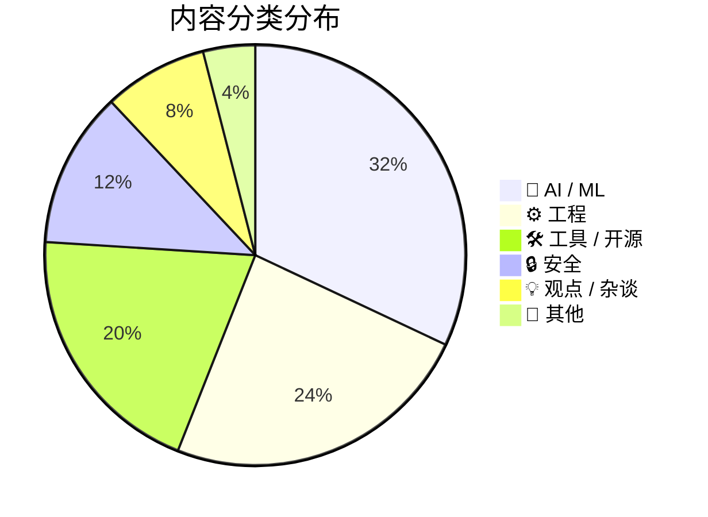
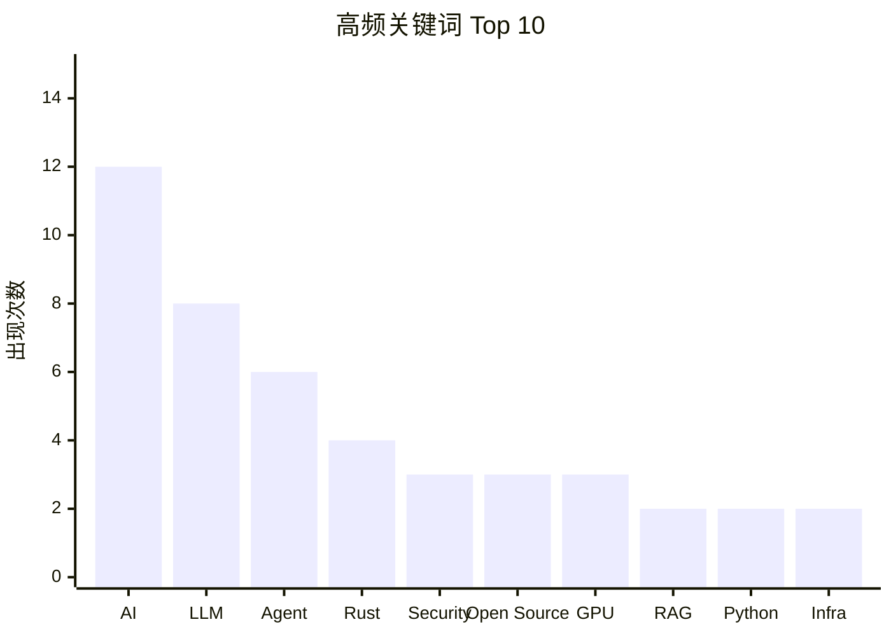
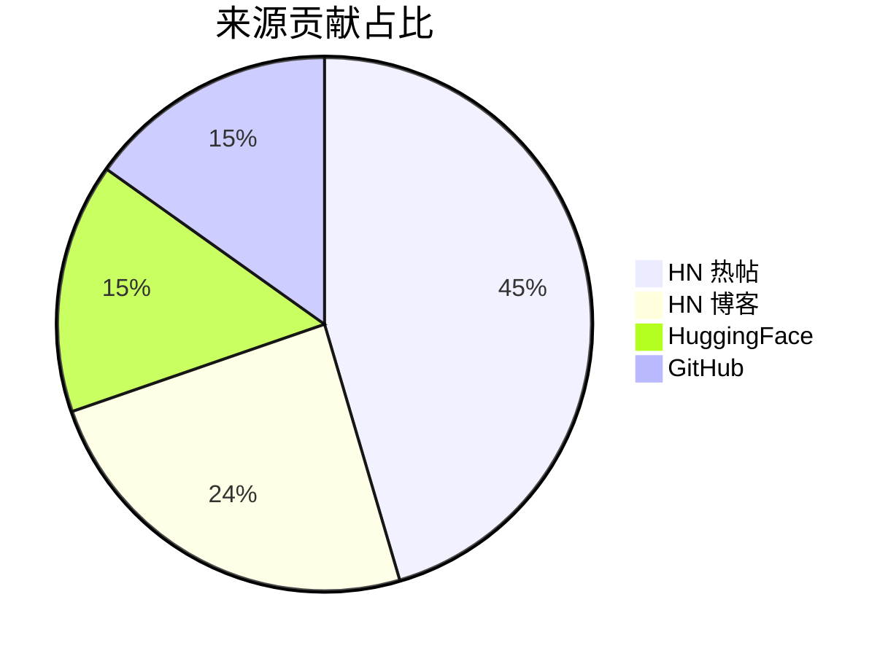

# 信息提取 Skills 统一格式规范

本文档定义了所有信息提取类 Skills 的统一输出格式规范。v3.0 新增：今日看点、今日必读、分类展示、数据概览。

## 一、报告结构（v3.0）

### 1.1 完整报告模板

```markdown
# 报告标题（YYYY-MM-DD）

> 简要描述：来源、数量等信息

---

## 📝 今日看点

> 3-5 句话的宏观趋势总结，帮助读者 30 秒把握当日技术圈大方向。

1. **趋势一标题** — 一句话描述
2. **趋势二标题** — 一句话描述
3. **趋势三标题** — 一句话描述

---

## 🏆 今日必读（Top 3）

> 深度展示当日最值得阅读的 3 篇内容

### 1. 中文标题 / English Title

- **摘要**：4-6 句结构化摘要，覆盖核心问题→关键论点→结论
- **推荐理由**：为什么值得读（1-2 句）
- **要点**：
  1. 关键要点一
  2. 关键要点二
  3. 关键要点三
- **来源**：[来源名称](URL) | [原文](URL)
- **关键词**：`keyword1` `keyword2` `keyword3`
- **评分**：⭐⭐⭐⭐⭐ (5/5)
- **评分详情**：相关性 9 | 质量 9 | 时效 8
- **热度**：来源特定格式
- **分类**：🤖 AI / ML

---

## 🔥 HackerNews 热帖

### 4. 标题

（标准条目格式）

---

## 📰 博客精选（HN Top Blogs）

### N. 中文标题 / English Title

- **作者**：博主名
- **摘要**：4-6 句结构化摘要
- **要点**：
  1. ...
  2. ...
  3. ...
- **来源**：[博客名](URL)
- **关键词**：`keyword1` `keyword2`
- **评分**：⭐⭐⭐⭐ (4/5)
- **评分详情**：相关性 8 | 质量 9 | 时效 7
- **分类**：⚙️ 工程

---

## 📄 HuggingFace 热门论文

（同原有格式）

---

## 📊 数据概览

### 📋 数据统计

| 指标 | 数值 |
|------|:----:|
| 信息源总数 | 5 |
| 收录条目 | 25 |
| 平均评分 | 4.2 / 5 |
| 最高评分 | 5 / 5 |
| HN 博客命中 | 8 / 90 feeds |
| 分类覆盖 | 5 / 6 |

### 分类分布

| 分类 | 数量 | 占比 | 条形图 |
|------|:----:|:----:|--------|
| 🤖 AI / ML | 8 | 32% | `████████████████` |
| ⚙️ 工程 | 6 | 24% | `████████████` |
| 🛠 工具 / 开源 | 5 | 20% | `██████████` |
| 🔒 安全 | 3 | 12% | `██████` |
| 💡 观点 / 杂谈 | 2 | 8% | `████` |
| 📝 其他 | 1 | 4% | `██` |

### 🥧 分类饼图



### 热度分布

| 来源 | 条目数 | 平均热度 | 最高热度 |
|------|:------:|:--------:|:--------:|
| HN 热帖 | 15 | 437 pts | 1,898 pts |
| HN 博客 | 8 | — | — |
| HuggingFace | 5 | 20 upvotes | 29 upvotes |
| GitHub | 5 | 2.9k ⭐ | 9.7k ⭐ |

### 📊 高频关键词柱状图



### 🏷️ 话题标签云

<div align="center">


</div>

### 📈 来源贡献对比



---

## 其他推荐

| 排名 | 标题 | 热度 | 来源 | 分类 |
|------|------|------|------|------|
| N+1 | [标题](URL) | 指标 | 来源 | 分类 |

---

*Generated by [Skill Name]*
*Date: YYYY-MM-DD*
```

### 1.2 标题格式

- 使用中文括号 `（）` 包裹日期
- 示例：`# Daily News Report（2026-02-15）`

### 1.3 描述行格式

- 使用 `>` 引用格式
- 包含来源数量和内容数量
- 示例：`> 本日筛选自 5 个信息源，共收录 25 条高质量内容`

---

## 二、标准条目格式

### 2.1 完整条目模板（v3.0 含分类和三维评分）

```markdown
## N. 条目标题

- **摘要**：2-3 句话概述核心内容和价值
- **要点**：
  1. 关键要点一
  2. 关键要点二
  3. 关键要点三
- **来源**：[来源名称](URL) | [原文](URL)
- **关键词**：`keyword1` `keyword2` `keyword3`
- **评分**：⭐⭐⭐⭐⭐ (5/5)
- **评分详情**：相关性 9 | 质量 8 | 时效 7
- **热度**：来源特定格式
- **分类**：🤖 AI / ML
```

### 2.2 今日必读条目模板（Top 3 深度展示）

```markdown
## N. 中文标题 / English Title

- **摘要**：4-6 句结构化摘要，覆盖核心问题→关键论点→结论
- **推荐理由**：为什么值得读（1-2 句）
- **要点**：
  1. 关键要点一
  2. 关键要点二
  3. 关键要点三
- **来源**：[来源名称](URL) | [原文](URL)
- **关键词**：`keyword1` `keyword2` `keyword3`
- **评分**：⭐⭐⭐⭐⭐ (5/5)
- **评分详情**：相关性 10 | 质量 9 | 时效 9
- **热度**：来源特定格式
- **分类**：🤖 AI / ML
```

### 2.3 博客精选条目模板（RSS 博客专用）

```markdown
## N. 中文标题 / English Title

- **作者**：博主名
- **摘要**：4-6 句结构化摘要
- **要点**：
  1. 关键要点一
  2. 关键要点二
  3. 关键要点三
- **来源**：[博客名](URL)
- **关键词**：`keyword1` `keyword2`
- **评分**：⭐⭐⭐⭐ (4/5)
- **评分详情**：相关性 8 | 质量 9 | 时效 7
- **分类**：⚙️ 工程
```

### 2.4 字段说明

| 字段 | 必需 | 说明 |
|------|------|------|
| 摘要 | 是 | 普通条目 2-3 句，必读/博客 4-6 句 |
| 推荐理由 | 仅必读 | 1-2 句，为什么值得读 |
| 作者 | 仅博客 | 博主名 |
| 要点 | 是 | 3 个数字编号的要点 |
| 来源 | 是 | 链接格式，多个链接用 `\|` 分隔 |
| 关键词 | 是 | 3-5 个关键词，使用反引号包裹 |
| 评分 | 是 | 星星格式 |
| 评分详情 | 是（v3.0） | 三维评分：相关性 \| 质量 \| 时效 |
| 热度 | 否 | 来源特定格式 |
| 分类 | 是（v3.0） | 六大分类之一 |

### 2.5 字段顺序

**严格按以下顺序排列**：
1. 摘要（必读条目含推荐理由）
2. 要点
3. 来源
4. 关键词
5. 评分
6. 评分详情
7. 热度（如有）
8. 分类

---

## 三、评分规范（v3.0 三维评分）

### 3.1 三维评分标准

| 维度 | 权重 | 1-3 分 | 4-6 分 | 7-10 分 |
|------|------|--------|--------|---------|
| 相关性 | 40% | 与技术无关 | 一般技术内容 | AI/前沿核心 |
| 质量 | 35% | 浅层/水文 | 有参考价值 | 深度原创/突破 |
| 时效性 | 25% | 过时内容 | 近期发布 | 刚发布/突发 |

### 3.2 最终星级映射

```
weighted = relevance * 0.4 + quality * 0.35 + timeliness * 0.25
star = round(weighted / 2)  # 1-5 星
```

| 加权分 | 星级 | 显示 |
|--------|------|------|
| 9-10 | 5 | `⭐⭐⭐⭐⭐ (5/5)` |
| 7-8.9 | 4 | `⭐⭐⭐⭐ (4/5)` |
| 5-6.9 | 3 | `⭐⭐⭐ (3/5)` |
| 3-4.9 | 2 | `⭐⭐ (2/5)` |
| 1-2.9 | 1 | `⭐ (1/5)` |

---

## 四、热度字段规范

### 4.1 按来源类型

| 来源类型 | 热度格式 | 示例 |
|----------|----------|------|
| HackerNews | `HN {points} points \| {comments} comments` | `HN 780 points \| 420 comments` |
| HN 博客 | `来源: {author} ({blog_name})` | `来源: Simon Willison (simonwillison.net)` |
| GitHub | `Stars {stars} \| Forks {forks} \| 更新于 {time}` | `Stars 24.4k \| Forks 2.4k` |
| HuggingFace | `Likes {likes} \| 论文编号 {paper_id}` | `Likes 129 \| 论文编号 2601.12538` |
| X/Twitter | `{likes} likes \| {retweets} retweets` | `1.2k likes \| 500 retweets` |

### 4.2 数字格式化

- 千位以上使用 `k` 后缀：`1.2k`, `24.4k`
- 万位以上使用 `w` 后缀：`1.5w`
- 保留一位小数

---

## 五、来源链接规范

### 5.1 来源名称映射

| 来源 | 显示名称 |
|------|----------|
| news.ycombinator.com | HackerNews |
| github.com | GitHub |
| huggingface.co | HuggingFace |
| x.com / twitter.com | X |
| RSS 博客 | 使用博主名或博客名 |
| 其他 | 使用域名或站点名 |

---

## 六、其他推荐表格规范（v3.0 含分类列）

```markdown
## 其他推荐

| 排名 | 标题 | 热度 | 来源 | 分类 |
|------|------|------|------|------|
| N+1 | [标题](URL) | 指标 | 来源 | 🤖 AI |
```

---

## 六点五、数据概览生成规范

本节定义数据概览中各可视化组件的动态生成规则。所有数据均从当次报告的实际内容中统计得出。

### 6.5.1 数据统计表格

从报告内容中统计以下指标：

| 指标 | 计算方式 |
|------|----------|
| 信息源总数 | 去重后的来源类型数 |
| 收录条目 | 报告中所有条目总数 |
| 平均评分 | 所有条目 final_score 的算术平均 |
| HN 博客命中 | 有新文章的 RSS feeds 数 / 总 enabled feeds 数 |
| 分类覆盖 | 有条目的分类数 / 6 |

### 6.5.2 分类分布表格（含 ASCII 条形图）

按六大分类统计条目数量，条形图使用 `█` 字符，每个 `██` 代表约 4% 占比：

```
占比计算：count / total * 100
条形长度：round(占比 / 2) 个 █ 字符
```

示例：32% → `████████████████`（16 个 █）

### 6.5.3 Mermaid 分类饼图

使用 Mermaid `pie` 图表，数据从分类统计中获取：


**注意**：Mermaid 饼图中的 emoji 在部分渲染器中可能不显示，可选择去掉 emoji 前缀。

### 6.5.4 Mermaid 高频关键词柱状图

使用 Mermaid `xychart-beta` 图表：

1. 统计所有条目的 `keywords` 字段
2. 按出现频次降序排列
3. 取 Top 10
4. 生成柱状图

```mermaid
xychart-beta
    title "高频关键词 Top 10"
    x-axis ["kw1", "kw2", ...]
    y-axis "出现次数" 0 --> max_count
    bar [count1, count2, ...]
```

### 6.5.5 SVG 话题标签云

动态生成内联 SVG 标签云，嵌入到 Markdown 中。

**生成规则**：

1. **数据源**：所有条目的 `keywords` 合并去重，统计频次
2. **字号映射**：
   - 频次最高的关键词：`font-size: 38px`
   - 频次最低的关键词：`font-size: 13px`
   - 中间线性插值：`size = 13 + (freq - min) / (max - min) * 25`
3. **颜色映射**（按分类）：
   - 🤖 AI / ML → `#e74c3c`（红）
   - 🔒 安全 → `#9b59b6`（紫）
   - ⚙️ 工程 → `#3498db`（蓝）
   - 🛠 工具 / 开源 → `#2ecc71`（绿）
   - 💡 观点 / 杂谈 → `#e67e22`（橙）
   - 📝 其他 → `#1abc9c`（青）
   - 跨分类关键词：使用出现最多的分类颜色
4. **布局**：
   - SVG 画布：`width="600" height="220"`
   - 关键词随机分布在画布内，避免重叠
   - 高频词居中偏上，低频词分布在边缘
5. **嵌入方式**：使用 data URI 内联嵌入

```html
<div align="center">

</div>
```

**SVG 模板**：

```xml
<svg xmlns='http://www.w3.org/2000/svg' width='600' height='220' viewBox='0 0 600 220'>
  <style>text{font-family:system-ui,-apple-system,sans-serif}</style>
  <!-- 每个关键词一个 <text> 元素 -->
  <text x='{x}' y='{y}' font-size='{size}' font-weight='{weight}' fill='{color}'>{keyword}</text>
  ...
</svg>
```

**font-weight 规则**：
- 频次 >= 中位数：`bold`
- 频次 < 中位数：`normal`

**位置分配算法**（简化版）：
```
1. 按频次降序排列关键词
2. 第 1 个词：居中 (300, 80)
3. 第 2 个词：偏右上 (380, 50)
4. 第 3 个词：偏左 (150, 100)
5. 后续词：在剩余空间中螺旋分布
6. y 坐标范围：30-200，x 坐标范围：20-580
```

### 6.5.6 Mermaid 来源贡献饼图

使用 Mermaid `pie` 图表，按来源类型统计条目数：


### 6.5.7 渲染兼容性说明

| 组件 | GitHub | Obsidian | VS Code | Notion |
|------|:------:|:--------:|:-------:|:------:|
| 数据统计表格 | ✅ | ✅ | ✅ | ✅ |
| ASCII 条形图 | ✅ | ✅ | ✅ | ✅ |
| Mermaid pie | ✅ | ✅ | ✅* | ❌ |
| Mermaid xychart | ✅ | ✅ | ✅* | ❌ |
| SVG 标签云 | ✅ | ✅ | ✅ | ❌ |

*VS Code 需要 Mermaid 预览插件

**降级策略**：对于不支持 Mermaid/SVG 的平台（如 Notion），ASCII 条形图和纯文本关键词列表作为降级方案已包含在报告中。

---

## 七、文件命名规范

| Skill | 输出目录 | 文件名示例 |
|-------|----------|------------|
| daily-news-report | `output_info/` | `2026-02-15-news-report.md` |
| x-digest | `output_info/` | `2026-02-15-ai-digest.md` |
| github-search | `output_info/GithubSearch/` | `2026-02-15-ai-agent.md` |
| info-collector | `output_info/` | `2026-02-15-full.md` |

---

## 八、格式检查清单（v3.0）

- [ ] 包含「今日看点」趋势总结（3-5 条）
- [ ] 包含「今日必读」Top 3 深度展示
- [ ] 标题使用中文括号 `（）`
- [ ] 评分使用星星格式 + 三维评分详情
- [ ] 每个条目包含分类标签
- [ ] 要点使用数字编号 `1. 2. 3.`
- [ ] 来源使用链接格式 `[名称](URL)`
- [ ] 关键词使用反引号包裹
- [ ] 包含「数据概览」完整五件套：
  - [ ] 📋 数据统计表格
  - [ ] 分类分布表格（含 ASCII 条形图）
  - [ ] 🥧 Mermaid 分类饼图
  - [ ] 📊 Mermaid xychart-beta 高频关键词柱状图
  - [ ] 🏷️ SVG 话题标签云（内联 data URI）
  - [ ] 📈 Mermaid 来源贡献饼图
- [ ] 条目之间使用 `---` 分隔
- [ ] 结尾包含生成标识和日期
